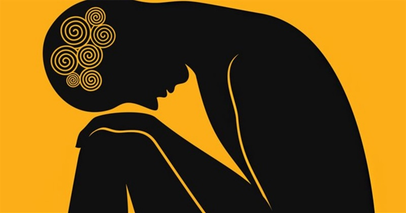

# The Quandary of Feelings
Feelings is a discord bot that helps people to calm down and relax.

# Aimed for- StarHacks

# Project Title: The Quandary of Feelings:
Feelings is a discord bot that helps people to calm down and relax.

## Inspiration
Since 2013, Millenials have seen a 47% increase in major- depression diagnoses. The overall rate increased from 3% to 4.4% among 18-34 years old. The reasons are not bounded, nor are they instant, but it's observed that people between the age limit 18-34 are hit by failures in their lives(it may be a career, Relationship, family problems, etc.). They lack self-motivation at the end and lose hope in their life; this gives way to depression. Thus, through our discord bot, we wish to give guidance to handle all such circumstances by motivating them and presenting examples of others. Through our bot, people can share their failures and success stories in person. This would build a strong community of motivated people who could combat life challenges and reach the pinnacle. Failure is not something to be ashamed of. We let you share your failures with the world and find relevant solutions. 
 
## Elevator Pitch
MindQuest, not just another app telling you what, how & when to do things. Instead, choose what you want to do, exchange ideas and play games with alike individuals and all for free.

## Built With
We built this bot using the documentation of discord.js. A lot of our functionalities are hard-coded in javascript, which is the heart of this project. We spent hours training the bot so that all the commands given by the user could be executed effectively. 
  

## What It does
Since most of the work is happening on discord nowadays, people usually need some way out when stress builds. That's when our bot comes to the rescue. The Quandry of Feelings is a project that aims to input how the user is feeling and output an affirmation or words of encouragement. It also gives the user a breathing exercise; users can send a hug gif to each other and lift their spirits. This bot predominantly runs on javascript. Using that as our base language, we have written the various functionalities required for the smooth functioning of all the commands to be executed.

## What’s Next
We are planning to have an in-built quiz where the user will answer 5 questions, and the bot will be able to predict the user's mood and send a joke, a funny video, a happy song (youtube link), and so on. We are also planning to optimize our bot by including ML(machine learning) so that it helps respond to the messages more effectively. We plan to add more features so that users of all types can make the most out of it.

## Challenges
As it was the first time we participated in a hackathon, we didn't have much experience. Many of us were completely unaware of all the new terms that we came across during this span. We spent hours going through the basics of node.js and discord.js documentation to write the functionalities effectively. We had several brainstorming sessions wherein we spent hours forming a clear picture of what we wanted to present. We were at different timezone we still could manage to catch up for calls and build our project together.

## Accomplishments We’re Proud Of
We are proud that we came together as a team and found a solution to a persisting problem. We were able to use our basic javascript knowledge to build a discord bot. 

## Learning Achievements
The very first thing we all learned was teamwork. As a beginner, we are always used to doing projects solo, but this was the first time we came together and executed this idea for a hackathon. We thought about the various problems around us and came up with a solution that we could build in the given time. The second thing we learned was how to build a discord bot from scratch and train it effectively so that it takes the user commands and outputs words of encouragement, a joke to make them laugh, or helps users support each other by sending a hug uplifting their spirits.
 We learned better tactics of collaboration and brainstorming. We also learned a lot of facts about mental health while researching, that we were unaware of. We learned about the problems people with mental illnesses face and what solutions they have available.
 
## Team
  1. Astha Nayak
  2. Prachi Nandi
  3. Sonakshi Satpathy
  4. Swatishree Mahapatra

